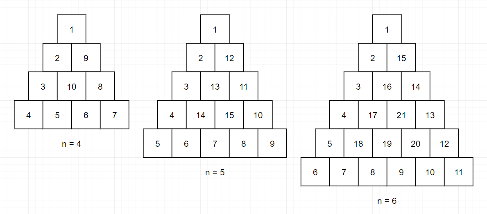

###### 문제 설명

정수 배열 numbers가 주어집니다. numbers에서 서로 다른 인덱스에 있는 두 개의 수를 뽑아 더해서 만들 수 있는 모든 수를 배열에 오름차순으로 담아 return 하도록 solution 함수를 완성해주세요.

------

##### 제한사항

- numbers의 길이는 2 이상 100 이하입니다.
  - numbers의 모든 수는 0 이상 100 이하입니다.

------

##### 입출력 예

| numbers       | result          |
| ------------- | --------------- |
| `[2,1,3,4,1]` | `[2,3,4,5,6,7]` |
| `[5,0,2,7]`   | `[2,5,7,9,12]`  |

------

##### 입출력 예 설명

입출력 예 #1

- 2 = 1 + 1 입니다. (1이 numbers에 두 개 있습니다.)
- 3 = 2 + 1 입니다.
- 4 = 1 + 3 입니다.
- 5 = 1 + 4 = 2 + 3 입니다.
- 6 = 2 + 4 입니다.
- 7 = 3 + 4 입니다.
- 따라서 `[2,3,4,5,6,7]` 을 return 해야 합니다.

입출력 예 #2

- 2 = 0 + 2 입니다.
- 5 = 5 + 0 입니다.
- 7 = 0 + 7 = 5 + 2 입니다.
- 9 = 2 + 7 입니다.
- 12 = 5 + 7 입니다.
- 따라서 `[2,5,7,9,12]` 를 return 해야 합니다.


```python
def solution(numbers):
    answer = set()
    for i in range(len(numbers)):
        for j in range(i,len(numbers)):
            if i==j:
                continue
            answer.add(numbers[i]+numbers[j])
    answer = list(answer)
    answer.sort()
    return answer
```

###### 문제 설명

정수 n이 매개변수로 주어집니다. 다음 그림과 같이 밑변의 길이와 높이가 n인 삼각형에서 맨 위 꼭짓점부터 반시계 방향으로 달팽이 채우기를 진행한 후, 첫 행부터 마지막 행까지 모두 순서대로 합친 새로운 배열을 return 하도록 solution 함수를 완성해주세요.



------

##### 제한사항

- n은 1 이상 1,000 이하입니다.

------

##### 입출력 예

| n    | result                                                    |
| ---- | --------------------------------------------------------- |
| 4    | `[1,2,9,3,10,8,4,5,6,7]`                                  |
| 5    | `[1,2,12,3,13,11,4,14,15,10,5,6,7,8,9]`                   |
| 6    | `[1,2,15,3,16,14,4,17,21,13,5,18,19,20,12,6,7,8,9,10,11]` |

------

##### 입출력 예 설명

입출력 예 #1

- 문제 예시와 같습니다.

입출력 예 #2

- 문제 예시와 같습니다.

입출력 예 #3

- 문제 예시와 같습니다.

